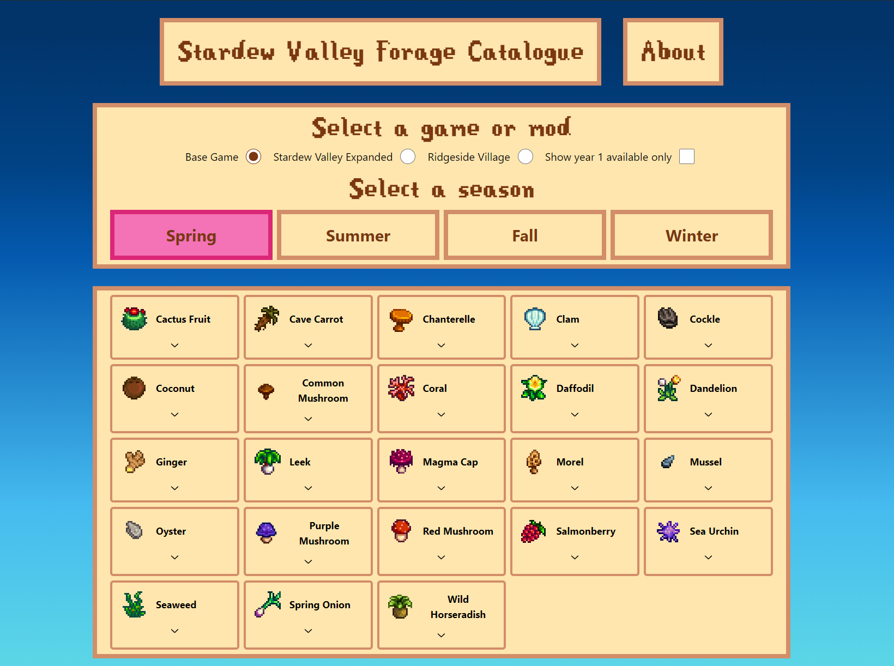

<!-- README template courtesy of https://github.com/othneildrew/Best-README-Template -->

<h3 align="center">Stardew Valley Forage Catalogue</h3>

  

    An easy to use visual catalogue for viewing forage items filtered by season in Stardew Valley. Includes items for the base game, Stardew Valley Expanded and Ridgeside Village.

(<a href="#readme-top">back to top</a>)

## Built With

- [![React][React.js]][React-url]
- [![TypeScript][TypeScript.com]][TypeScript-url]
- [![React Query][ReactQuery.com]][ReactQuery-url]
- [![TailwindCSS][TailwindCSS.com]][TailwindCSS-url]
- [![Radix UI][RadixUI.com]][RadixUI-url]
- [![Cloudinary][Cloudinary.com]][Cloudinary-url]
- [![Node.js][Node.js]][Node-url]
- [![Express][Express.js]][Express-url]
- [![MongoDB][MongoDB.com]][MongoDB-url]
- [![Mongoose][Mongoose.js]][Mongoose-url]

(<a href="#readme-top">back to top</a>)

<!-- MARKDOWN LINKS & IMAGES -->

[React.js]: https://img.shields.io/badge/React-20232A?style=for-the-badge&logo=react&logoColor=61DAFB
[React-url]: https://reactjs.org/
[TailwindCSS.com]: https://img.shields.io/badge/Tailwind_CSS-38B2AC?style=for-the-badge&logo=tailwind-css&logoColor=white
[TailwindCSS-url]: https://tailwindcss.com/
[ReactQuery.com]: https://img.shields.io/badge/React_Query-FF4154?style=for-the-badge&logo=react-query&logoColor=white
[ReactQuery-url]: https://react-query.tanstack.com/
[Node.js]: https://img.shields.io/badge/Node.js-43853D?style=for-the-badge&logo=node-dot-js&logoColor=white
[Node-url]: https://nodejs.org/
[Express.js]: https://img.shields.io/badge/Express-000000?style=for-the-badge&logo=express&logoColor=white
[Express-url]: https://expressjs.com/
[Mongoose.js]: https://img.shields.io/badge/Mongoose-880000?style=for-the-badge&logo=mongoose&logoColor=white
[Mongoose-url]: https://mongoosejs.com/
[TypeScript.com]: https://img.shields.io/badge/TypeScript-3178C6?style=for-the-badge&logo=typescript&logoColor=white
[TypeScript-url]: https://www.typescriptlang.org/
[Cloudinary.com]: https://img.shields.io/badge/Cloudinary-3448C5?style=for-the-badge&logo=cloudinary&logoColor=white
[Cloudinary-url]: https://cloudinary.com/
[RadixUI.com]: https://img.shields.io/badge/Radix_UI-FF4088?style=for-the-badge&logo=radix-ui&logoColor=white
[RadixUI-url]: https://www.radix-ui.com/
[MongoDB.com]: https://img.shields.io/badge/MongoDB-47A248?style=for-the-badge&logo=mongodb&logoColor=white
[MongoDB-url]: https://www.mongodb.com/
